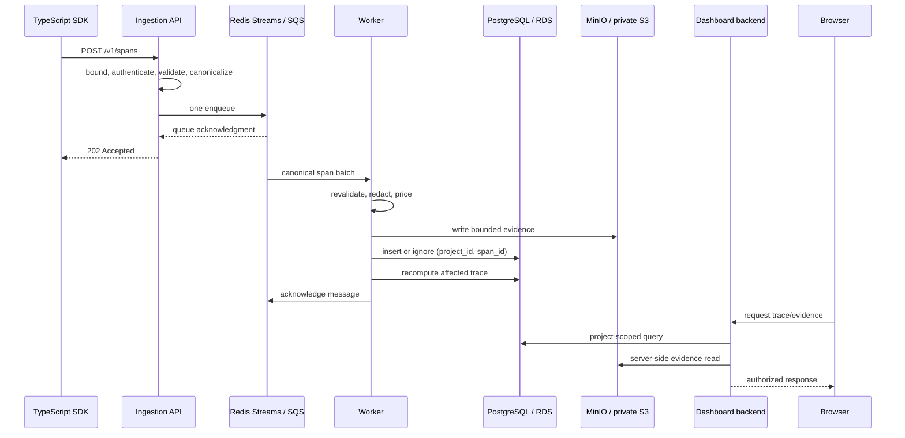

# AgentRail Milestone 1 Architecture

AgentRail accepts immutable completed span envelopes, acknowledges them after a durable queue write, and processes pricing and evidence asynchronously.

## Ingestion boundary

The API returns `202 Accepted` only after a successful queue acknowledgment. It does not wait for a worker consumer and performs no pricing lookup, PostgreSQL span write, blob write, or trace aggregation in the request path. An enqueue failure returns retryable `503`, never a false `202`.

The API authenticates a bearer key by its non-secret prefix and a peppered HMAC-SHA-256 digest. PostgreSQL stores the prefix and digest, not the raw key. The authenticated key determines `project_id`; clients cannot choose their own project scope.

## Idempotency

The canonical idempotency key is exactly `(project_id, span_id)`. PostgreSQL enforces it through a composite unique index and insert-on-conflict-ignore behavior. Queue message IDs are transport receipts, not domain event IDs. Duplicate delivery does not overwrite a persisted span or change the trace aggregate.

## Worker ownership

The worker owns canonical revalidation, payload policy, redaction, truncation, price lookup, blob persistence, span insertion, and trace reconciliation. The SDK can submit model and token usage, but it never submits authoritative `cost_usd`.

If a model is absent from the catalog, the span stores `cost_usd = null` and `pricing_unknown = true`. If any priced span in a trace has unknown pricing, the trace total is also null rather than a misleading partial subtotal.

## Trace completion

`TRACE_INCOMPLETE_AFTER_MS` is shared configuration with a default of 900,000 ms. Reconciliation marks an open trace incomplete at the inclusive timeout boundary. There is no `running` state in Milestone 1.

## Evidence boundary

Project payload mode is `none`, `redacted`, or explicit local-only `full`. Redaction covers authorization data, cookies, passwords, API keys, access tokens, and common secret names recursively. Payloads are bounded before storage.

The future dashboard browser never talks to MinIO or S3 directly. It requests evidence from a backend route that verifies project scope and reads the opaque blob reference server-side.

## Local-to-AWS ports

The code isolates infrastructure behind queue and blob interfaces:

| Concern          | Local adapter    | AWS adapter/reference                                     |
| ---------------- | ---------------- | --------------------------------------------------------- |
| Queue            | Redis Streams    | Amazon SQS                                                |
| Evidence         | MinIO            | private Amazon S3                                         |
| Relational state | PostgreSQL       | Amazon RDS for PostgreSQL                                 |
| Ingestion        | Hono Node server | API Gateway + Lambda target adapter, or container runtime |
| Worker           | Node process     | Lambda SQS consumer or container worker                   |

The AWS column is a reference mapping, not deployed infrastructure. See [deployment notes](deployment/aws.md).
