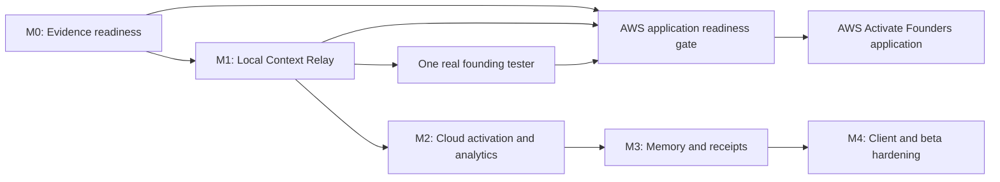
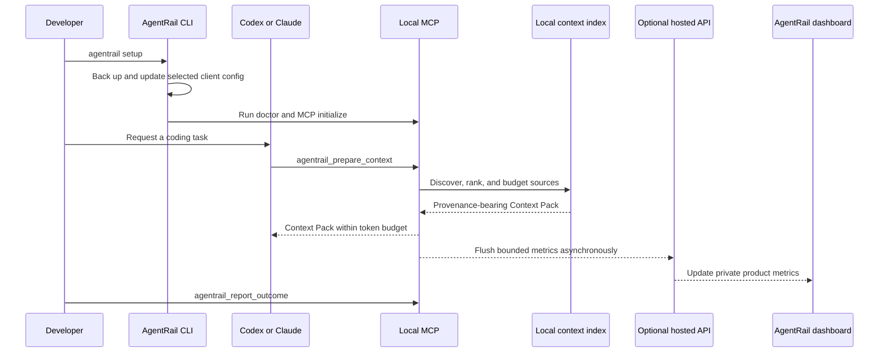

# AgentRail Context Relay Delivery Roadmap

> **For agentic workers:** REQUIRED SUB-SKILL: Use
> `superpowers:subagent-driven-development` (recommended) or
> `superpowers:executing-plans` to execute one milestone plan at a time. Do not
> start a later milestone until the prior milestone exit gate is green.

**Goal:** Deliver AgentRail Context Relay as a local-first MCP product for
individual AI developers, add optional hosted activation and truthful usage
analytics, preserve the existing forensic trace product, and produce the
evidence required for an honest AWS Activate Founders application.

**Architecture:** Keep context discovery, ranking, budgeting, and local memory
inside the developer's machine. Treat hosted services as an optional control
plane for activation, bounded metrics, receipts, and evidence. Reuse the
existing Hono ingestion boundary, queue/worker pattern, PostgreSQL repository,
private blob access, and Next.js website. Existing trace IDs, routes,
idempotency, and project scoping remain stable.

**Tech Stack:** Node.js 24, pnpm 11, TypeScript 5.9, MCP TypeScript SDK 1.x,
Zod 4, Hono 4, Next.js 16.2, React 19, Drizzle ORM 0.45, PostgreSQL, Redis
Streams locally, Amazon API Gateway/Lambda/SQS/RDS/S3/Secrets Manager/CloudWatch
for the hosted reference deployment, Vitest 4, Playwright 1.61, and
`@axe-core/playwright`.

## Global Constraints

- The approved system design is
  `docs/superpowers/specs/2026-07-29-agentrail-context-relay-design.md`.
- Package names remain under the existing `@agentrail-sdk/*` npm scope.
- Existing `/traces` and `/traces/[traceId]` URLs and trace ingestion semantics
  remain stable.
- Existing forensic MCP tools remain available only through the explicit
  `context+forensics` profile.
- The default MCP profile contains exactly four Context Relay tools:
  `agentrail_prepare_context`, `agentrail_recall`, `agentrail_remember`, and
  `agentrail_report_outcome`.
- Context Pack generation is local-first and must work without an AgentRail
  account, network connection, Docker, native dependency, or always-on daemon.
- Hosted telemetry never blocks Context Pack generation.
- `local-only` sends no cloud event. `metrics-only` sends no task, prompt, file
  path, source text, patch, environment value, or secret. Evidence sync is
  opt-in.
- Do not add embeddings, an LLM reranker, a graph database, a remote MCP
  profile, team billing, or public usage counters in these milestones.
- Do not advertise a client before its compatibility fixture passes on Windows
  and POSIX path shapes.
- Do not fabricate traction, customers, npm activity, savings, AWS acceptance,
  or funding.
- Keep the landing-specific anti-slop design rules isolated from the forensic
  dashboard. Dashboard data surfaces remain graphite, warm white, amber,
  small-radius, information-dense, and nearly shadowless.
- Use Phosphor as the only icon family and preserve Instrument Sans plus
  JetBrains Mono.
- Browser code never reads private object storage directly.
- All cloud reads and writes are project-scoped and server-authorized.
- Every implementation task uses red-green TDD, focused verification, and a
  small commit.
- Run shell commands through `rtk` and verify Node.js 24 before package,
  build, or test commands.
- Use `apply_patch` for source edits. Preserve unrelated user changes and never
  stage generated or unrelated files.

## Plan Map

| Order | Plan file                                                  | Primary outcome                                                   | Can AWS readiness gate use it? |
| ----- | ---------------------------------------------------------- | ----------------------------------------------------------------- | ------------------------------ |
| M0    | `2026-07-29-agentrail-m0-evidence-readiness.md`            | Green CI, truthful public evidence, legal/trust, tester intake    | Required                       |
| M1    | `2026-07-29-agentrail-m1-local-context-relay.md`           | Working local Context Pack in Codex and Claude                    | Required                       |
| M2    | `2026-07-29-agentrail-m2-cloud-activation-analytics.md`    | Login, device activation, metrics, user/founder dashboards        | Valuable, not blocking         |
| M3    | `2026-07-29-agentrail-m3-memory-receipts-trace-linking.md` | Hosted memory lifecycle, private receipts, and trace-linked proof | Valuable, not blocking         |
| M4    | `2026-07-29-agentrail-m4-client-beta-hardening.md`         | More clients, benchmarks, privacy operations, beta hardening      | Not required                   |

## Approved Spec Coverage

| Approved design area                         | Delivery owner | Acceptance evidence                                       |
| -------------------------------------------- | -------------- | --------------------------------------------------------- |
| Truthful public evidence and AWS application | M0             | CI, production smoke, legal/trust pages, application pack |
| Local scanner, index, ranking, and budget    | M1             | deterministic fixtures, secret tests, Context Pack E2E    |
| Four default MCP tools and client setup      | M1             | exact tool discovery, Codex/Claude setup and rollback     |
| Local memory, receipts, outcomes, and spool  | M1             | offline lifecycle and privacy-mode tests                  |
| Optional login, activation, and safe metrics | M2             | device flow E2E and strict event allowlist                |
| User and founder analytics                   | M2             | project-scoped read models from accepted events           |
| Hosted memory, evidence, receipt, trace link | M3             | private receipt-to-trace E2E and revocable sharing        |
| Cursor, VS Code, and Gemini compatibility    | M4             | per-client fixtures and five-client lifecycle matrix      |
| Benchmark, privacy operations, beta proof    | M4             | 30-task benchmark, export/delete, production beta gate    |

## Dependency Graph



M2 can begin after M1 contracts are stable, but the AWS application does not
need to wait for M2–M4. It does need one real user-produced Context Pack and an
AWS Paid Tier account whose details match the application.

## Cross-Milestone Package and Route Ownership

```text
packages/context/                            local scanner, cache, ranking, budget
packages/cli/                                setup, doctor, context, login, uninstall
packages/mcp/                                Context Relay and optional forensics profiles
packages/contracts/                          span, usage event, activation, receipt contracts
packages/db/                                 hosted persistence and repositories
packages/queue/                              span and usage-event queue adapters
apps/ingest/                                 fast authenticated 202 endpoints
apps/worker/                                 idempotent async processing and aggregation
apps/web/app/(marketing)/                    landing, docs, legal, architecture
apps/web/app/(auth)/                         login and device activation
apps/web/app/(product)/dashboard/            authenticated user product
apps/web/app/(product)/receipts/             private receipt views
apps/web/app/(admin)/admin/analytics/         role-protected founder analytics
apps/web/app/(dashboard)/traces/              existing forensic product
tests/fixtures/context-repositories/         deterministic context quality fixtures
tests/fixtures/client-configs/                compatibility and rollback fixtures
tests/npm/                                   clean tarball and registry install proof
infra/aws/                                   hosted reference deployment
```

## Release Train and Version Boundaries

1. M0 repairs the currently published package truth without changing the MCP
   default profile.
2. M1 publishes the new context engine and CLI, and releases the MCP profile
   change with migration notes. It must use a semver minor for additive tools
   and a clearly documented default-profile change.
3. M2 adds hosted APIs using versioned `/v1` contracts. Local Context Relay
   remains operational if the hosted service is absent.
4. M3 extends existing versioned contracts; it does not make evidence sync the
   default.
5. M4 publishes only clients with green fixtures and provenance-backed npm
   artifacts.

Before each npm release:

```bash
rtk pnpm install --frozen-lockfile
rtk pnpm format:check
rtk pnpm typecheck
rtk pnpm test
rtk pnpm build
rtk pnpm test:e2e
rtk pnpm exec tsx scripts/verify-npm-release.ts --mode tarball
```

Expected: every command exits `0`; clean temporary installs can import the SDK,
run the CLI, initialize MCP, and discover the exact profile tool list.

## End-to-End Product Proof

The complete product proof follows this sequence:



Required proof artifacts:

- a clean Codex setup fixture;
- a clean Claude setup fixture;
- an existing-config merge fixture;
- setup twice without duplication;
- uninstall restoring the previous config;
- a real fixture repository Context Pack within budget;
- source provenance and deterministic ranking;
- local-only network silence;
- metrics-only field allowlist;
- one real founding tester record with consent;
- green public CI and a production smoke report.

## AWS Application Readiness Gate

The application may proceed only when all boxes below are evidenced:

- [ ] M0 CI, documentation, npm, legal, trust, SEO, and CTA checks pass.
- [ ] M1 clean install, CLI setup, MCP initialization, and Context Pack E2E pass.
- [ ] At least one real founding tester produces a Context Pack and consents to
      an anonymized application statement.
- [ ] The application pack contains no unsupported customer, traction, savings,
      or deployment claim.
- [ ] The AWS architecture document maps actual components to API Gateway,
      Lambda, SQS, RDS PostgreSQL, S3, Secrets Manager, and CloudWatch.
- [ ] The 90-day AWS credit use plan includes budget alarms and conservative
      traffic assumptions.
- [ ] The applicant has a valid AWS Paid Tier account and the account/company
      identity is consistent across AWS, website, npm, and GitHub.
- [ ] `agentrail.id`, npm packages, GitHub source, security policy, privacy
      policy, and contact path are publicly reachable.

Passing this gate improves application quality; it never guarantees acceptance
or credits.

## Product and Quality SLOs

| Surface                   | Release gate                                                     |
| ------------------------- | ---------------------------------------------------------------- |
| MCP startup               | p95 below 250 ms without scanning                                |
| Warm Context Pack         | p95 below 1.5 s on benchmark medium repository                   |
| Cold Context Pack         | full or labeled partial result within 5 s                        |
| Context budget            | returned estimate never exceeds requested budget                 |
| Required-file recall      | at least 90% on the fixed benchmark dataset                      |
| Secret leakage            | zero known fixture secrets                                       |
| Metrics-only privacy      | zero task, path, prompt, patch, source, env, or secret fields    |
| Ingestion                 | 202 only after fast enqueue; p95 target documented per load test |
| Accessibility             | no serious/critical axe violations in tested routes              |
| Landing performance       | LCP <2.5 s, INP <200 ms, CLS <0.1 in production audit            |
| Uninstall                 | restores or safely merges prior client configuration             |
| Existing trace regression | all trace read, evidence, and E2E tests remain green             |

## Execution Protocol

For every milestone:

1. Verify a clean or intentionally dirty worktree and record unrelated files.
2. Verify Node.js 24 and pnpm 11.
3. Execute tasks in order; do not batch commits across task boundaries.
4. Run the focused RED test before writing implementation.
5. Implement only the minimal behavior described by the task.
6. Run the focused GREEN test and typecheck.
7. Commit only listed files.
8. At the milestone exit gate, run the full relevant suite and inspect the
   actual output before making a completion claim.
9. Request code review before merging or publishing.
10. Use `superpowers:verification-before-completion` before the milestone is
    declared complete.

## Rollback Strategy

- M0 is documentation, CI, and public trust work; revert individual commits if
  a public assertion is not verifiable.
- M1 setup always writes a timestamped backup before client config mutation.
  `agentrail uninstall` removes only the owned AgentRail entry.
- M2 credentials are individually revocable; hosted failure automatically
  degrades to local-only operation.
- M3 evidence sync is opt-in and can be disabled without deleting local memory.
  Receipt sharing uses revocable digest-backed tokens.
- M4 adapters are independently advertised and can be removed from support
  matrices without affecting core Codex/Claude operation.

## Final Definition of Done

AgentRail Context Relay is considered delivered when:

- a new individual developer can install it in under five minutes;
- Codex and Claude can request a real repository Context Pack;
- the pack respects budget and includes provenance;
- local-only and metrics-only privacy contracts are proven by tests;
- optional hosted metrics update user and founder views from the same accepted
  events;
- private receipts and related traces are project-scoped;
- uninstall restores client configuration;
- public documentation contains only verified commands and client support;
- CI, tarball smoke, registry smoke, accessibility, security, performance, and
  production smoke gates are green.
