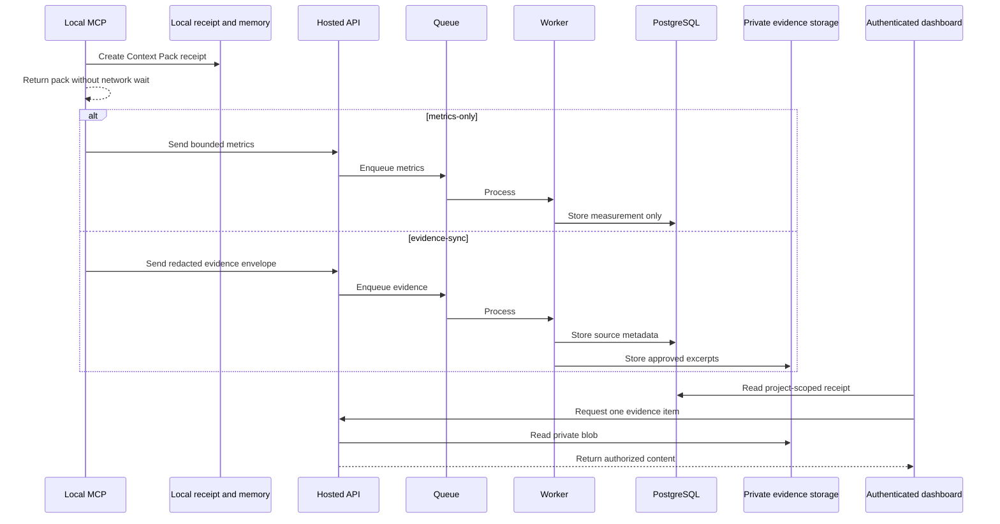

# AgentRail M3 Memory, Receipts, and Trace Linking Implementation Plan

> **For agentic workers:** REQUIRED SUB-SKILL: Use
> `superpowers:subagent-driven-development` (recommended) or
> `superpowers:executing-plans` task-by-task. Use
> `superpowers:systematic-debugging` for authorization, redaction, storage, or
> migration failures and `superpowers:verification-before-completion` at exit.

**Goal:** Turn local Context Packs into private, reviewable receipts; let users
manage structured project memory; optionally sync redacted evidence; associate
outcomes and forensic traces with the Context Pack that informed a task; and
support explicit revocable receipt sharing.

**Architecture:** Local memory and receipts remain authoritative for offline
operation. Metrics-only events continue to contain no source ledger. An
evidence-sync project can enqueue a separately validated, redacted evidence
envelope. The worker stores metadata in PostgreSQL and encrypted evidence in
private object storage. Next.js Server Components read project-scoped receipt
metadata, while source content loads on demand through authenticated backend
routes. Trace linkage adds an optional `pack_id` without changing existing
trace/span idempotency.

**Tech Stack:** Node.js 24, pnpm 11, TypeScript 5.9, Zod 4, Hono 4,
PostgreSQL/Drizzle, Redis Streams/SQS, S3/MinIO, Next.js 16.2, React 19,
Vitest 4, Playwright 1.61.

## Global Constraints

- M0–M2 must be green.
- Local memory and Context Pack generation work without hosted service.
- Memory is structured and explicit; never store full chat history.
- Agent output is never silently promoted into durable memory.
- Metrics-only receipts never show source paths, source ledger, excerpts, or
  selection details that were not synced.
- Evidence sync is opt-in per project and redacted both locally and server-side.
- Absolute paths, environment values, credentials, and known secret patterns
  never enter evidence envelopes.
- Browser code never receives object-store credentials or direct object URLs.
- Receipt authorization failures reveal no existence metadata.
- Private is the default visibility.
- Sharing requires field review, redaction, confirmation, and a revocable
  high-entropy token stored only as a digest.
- Trace idempotency remains `(project_id, span_id)`.
- Usage-event idempotency remains `(installation_id, event_id)`.
- Existing trace records without `pack_id` remain valid.
- Do not implement automatic synchronized-memory conflict resolution. Explicit
  push uses optimistic revision and returns a conflict for user review.
- Do not add team membership, billing, or a public receipt gallery.
- Every task uses TDD and project-scope authorization tests.
- Every **Verify RED** command must fail on a newly added behavioral assertion
  because the named production behavior is absent. Syntax, migration setup,
  storage availability, or credential failures are not acceptable RED states.

## Data Flow



---

### Task 1: Define Memory Sync, Receipt, Evidence, and Outcome Contracts

**Files:**

- Create: `packages/contracts/src/memory.ts`
- Create: `packages/contracts/src/memory.test.ts`
- Create: `packages/contracts/src/receipt.ts`
- Create: `packages/contracts/src/receipt.test.ts`
- Create: `packages/contracts/src/evidence.ts`
- Create: `packages/contracts/src/evidence.test.ts`
- Modify: `packages/contracts/src/index.ts`

**Interfaces:**

```ts
export const ProjectMemorySyncSchema = z
  .object({
    schema_version: z.literal(1),
    memory_id: z.string().regex(/^mem_[A-Za-z0-9_-]{24,}$/),
    revision: z.number().int().positive(),
    type: z.enum([
      "architecture",
      "constraint",
      "convention",
      "rejected_approach",
      "risk",
      "workaround",
    ]),
    status: z.enum([
      "active",
      "superseded",
      "expired",
      "review_required",
      "deleted",
    ]),
    statement_redacted: z.string().min(1).max(2_000),
    scope: z.string().min(1).max(200),
    source_kind: z.enum(["explicit_tool", "manual_dashboard", "import"]),
    expires_at: z.iso.datetime().nullable(),
    updated_at: z.iso.datetime(),
  })
  .strict();

export const EvidenceSourceSchema = z
  .object({
    source_id: z.string().min(24).max(100),
    trust_class: z.enum([
      "trusted_instruction",
      "project_source",
      "project_documentation",
      "project_memory",
      "untrusted_content",
    ]),
    relative_path: z.string().max(500),
    locator: z.object({
      start_line: z.number().int().positive(),
      end_line: z.number().int().positive(),
      symbol: z.string().max(200).nullable(),
    }),
    content_hash: z.string().regex(/^[0-9a-f]{64}$/),
    selection_reasons: z.array(z.string().max(100)).max(20),
    excerpt_redacted: z.string().max(8_000).optional(),
  })
  .strict();
```

- [ ] **Step 1: Write failing strict-schema tests**

Prove:

- unknown fields fail at every nested level;
- absolute Windows/POSIX paths fail;
- `..`, NUL, credential-like filenames, and environment keys fail;
- locator end precedes start fails;
- max 100 sources per envelope;
- max serialized envelope 240 KB;
- memory deleted state may carry a tombstone but not a statement body;
- outcome reason is an enum, not free text;
- share review includes only explicit fields.

- [ ] **Step 2: Verify RED**

Run:

```powershell
rtk vitest run packages/contracts/src/memory.test.ts packages/contracts/src/receipt.test.ts packages/contracts/src/evidence.test.ts
```

- [ ] **Step 3: Implement exact schemas and canonical types**

Canonical hosted envelopes add project and installation from authenticated
server context. Client-supplied project/installation fields are prohibited.

- [ ] **Step 4: Verify GREEN and commit**

Run:

```powershell
rtk vitest run packages/contracts/src/memory.test.ts packages/contracts/src/receipt.test.ts packages/contracts/src/evidence.test.ts
rtk tsc -p packages/contracts/tsconfig.json --noEmit
```

Commit:

```powershell
rtk git add packages/contracts/src/memory.ts packages/contracts/src/memory.test.ts packages/contracts/src/receipt.ts packages/contracts/src/receipt.test.ts packages/contracts/src/evidence.ts packages/contracts/src/evidence.test.ts packages/contracts/src/index.ts
rtk git commit -m "feat(contracts): define memory and receipt evidence"
```

---

### Task 2: Extend Hosted Persistence Without Breaking Existing Traces

**Files:**

- Modify: `packages/db/src/schema.ts`
- Modify: `packages/db/src/index.ts`
- Create: `packages/db/src/receipt-repository.ts`
- Create: `packages/db/src/receipt-repository.integration.test.ts`
- Create: `packages/db/migrations/0002_memory_receipts.sql`
- Modify: `packages/db/migrations/meta/_journal.json`
- Modify: `packages/db/src/span-repository.integration.test.ts`

**Interfaces:**

Tables/columns:

```text
project_memories
context_sources
receipts
outcome_reports
shared_receipts
traces.pack_id nullable
```

Repository:

```ts
export function createReceiptRepository(db: AgentRailDatabase): {
  upsertMemory(
    input: ProjectScopedMemory,
  ): Promise<
    | { status: "stored"; revision: number }
    | { status: "conflict"; currentRevision: number }
  >;
  listMemories(input: MemoryListInput): Promise<MemoryPage>;
  upsertReceipt(input: ReceiptWrite): Promise<void>;
  replaceContextSources(input: EvidenceSourceWriteBatch): Promise<void>;
  getReceipt(input: {
    projectId: string;
    receiptId: string;
  }): Promise<ReceiptDetail | null>;
  insertOutcome(input: OutcomeWrite): Promise<"inserted" | "duplicate">;
  createShare(input: ShareWrite): Promise<void>;
  revokeShare(input: {
    projectId: string;
    receiptId: string;
  }): Promise<boolean>;
  getSharedReceiptByDigest(digest: string): Promise<SharedReceipt | null>;
};
```

- [ ] **Step 1: Write failing migration and scope tests**

Prove:

- old trace rows migrate with `pack_id = null`;
- existing span idempotency still passes;
- receipt ID is unique within project and cross-project lookup is null;
- metrics-only receipt persists measurement with zero context sources;
- evidence-sync receipt can own sources;
- optimistic memory update accepts next revision and rejects stale revision;
- deleted memory is a tombstone;
- duplicate outcome does not inflate count;
- trace may link only to a pack in the same project;
- share digest is stored but raw token is absent;
- revoke is project-scoped.

- [ ] **Step 2: Verify RED**

Run:

```powershell
rtk vitest run packages/db/src/receipt-repository.integration.test.ts packages/db/src/span-repository.integration.test.ts
```

- [ ] **Step 3: Implement forward-only migration**

Indexes:

- `(project_memories.project_id, status, updated_at)`;
- `(context_sources.project_id, pack_id)`;
- `(receipts.project_id, created_at)`;
- `(outcome_reports.project_id, pack_id, installation_id, event_id)` unique;
- `shared_receipts.share_token_digest` unique;
- `(traces.project_id, pack_id)`.

Foreign keys always include project scope where the parent key is composite.

- [ ] **Step 4: Verify GREEN and commit**

Run:

```powershell
rtk pnpm --filter @agentrail-sdk/db db:migrate
rtk vitest run packages/db/src/receipt-repository.integration.test.ts packages/db/src/span-repository.integration.test.ts
rtk tsc -p packages/db/tsconfig.json --noEmit
```

Commit:

```powershell
rtk git add packages/db/src/schema.ts packages/db/src/index.ts packages/db/src/receipt-repository.ts packages/db/src/receipt-repository.integration.test.ts packages/db/migrations/0002_memory_receipts.sql packages/db/migrations/meta/_journal.json packages/db/src/span-repository.integration.test.ts
rtk git commit -m "feat(db): persist memories receipts and trace links"
```

---

### Task 3: Add Explicit Memory Push and Reviewable Lifecycle

**Files:**

- Create: `apps/ingest/src/memory-sync.ts`
- Create: `apps/ingest/src/memory-sync.test.ts`
- Modify: `apps/ingest/src/app.ts`
- Modify: `apps/ingest/src/runtime.ts`
- Create: `packages/cli/src/commands/memory.ts`
- Create: `packages/cli/src/commands/memory.test.ts`
- Modify: `packages/cli/src/args.ts`
- Modify: `packages/cli/src/main.ts`
- Modify: `packages/context/src/memory.ts`

**Interfaces:**

Routes/commands:

```text
POST /v1/memories
agentrail memory list
agentrail memory push --id mem_1234567890abcdefghijklmn
agentrail memory expire --id mem_1234567890abcdefghijklmn
```

- [ ] **Step 1: Write failing explicit-sync tests**

Prove:

- local remember does not auto-upload;
- push requires non-local privacy mode and active credential;
- API canonicalizes project/installation;
- stale revision returns 409 with only current revision, not statement;
- deleted tombstone removes default recall but remains auditable;
- expiry changes recall status based on injected clock;
- a model cannot create memory without the explicit MCP write tool call;
- metrics event never contains memory statement;
- raw statement does not appear in logs.

- [ ] **Step 2: Verify RED**

Run:

```powershell
rtk vitest run apps/ingest/src/memory-sync.test.ts packages/cli/src/commands/memory.test.ts packages/context/src/memory.test.ts
```

- [ ] **Step 3: Implement explicit lifecycle**

The server stores only `statement_redacted`. Local and server revisions start at
one and increment on explicit edits. Conflicts produce a local
`review_required` state; no last-write-wins merge.

- [ ] **Step 4: Verify GREEN and commit**

Run:

```powershell
rtk vitest run apps/ingest/src/memory-sync.test.ts packages/cli/src/commands/memory.test.ts packages/context/src/memory.test.ts
rtk tsc -p apps/ingest/tsconfig.json --noEmit
rtk tsc -p packages/cli/tsconfig.json --noEmit
```

Commit:

```powershell
rtk git add apps/ingest/src/memory-sync.ts apps/ingest/src/memory-sync.test.ts apps/ingest/src/app.ts apps/ingest/src/runtime.ts packages/cli/src/commands/memory.ts packages/cli/src/commands/memory.test.ts packages/cli/src/args.ts packages/cli/src/main.ts packages/context/src/memory.ts
rtk git commit -m "feat(memory): sync explicit project decisions"
```

---

### Task 4: Redact, Enqueue, and Store Optional Evidence

**Files:**

- Create: `packages/privacy/package.json`
- Create: `packages/privacy/tsconfig.json`
- Create: `packages/privacy/src/redact.ts`
- Create: `packages/privacy/src/redact.test.ts`
- Create: `packages/privacy/src/index.ts`
- Create: `packages/context/src/evidence-sync.ts`
- Create: `packages/context/src/evidence-sync.test.ts`
- Create: `packages/queue/src/evidence-types.ts`
- Create: `packages/queue/src/evidence-memory.ts`
- Create: `packages/queue/src/evidence-memory.test.ts`
- Create: `apps/ingest/src/evidence-events.ts`
- Create: `apps/ingest/src/evidence-events.test.ts`
- Create: `apps/worker/src/process-evidence.ts`
- Create: `apps/worker/src/process-evidence.integration.test.ts`
- Modify: `vitest.config.ts`
- Modify: `pnpm-lock.yaml`

**Interfaces:**

```ts
export type RedactionResult = {
  text: string;
  redacted: boolean;
  reasons: readonly (
    | "credential"
    | "private_key"
    | "environment_assignment"
    | "high_entropy_token"
    | "absolute_path"
  )[];
};

export function redactEvidence(text: string): RedactionResult;
```

- [ ] **Step 1: Write failing redaction and boundary tests**

Fixtures cover:

- AWS-style access keys;
- npm tokens;
- GitHub tokens;
- bearer tokens;
- PEM private keys;
- `.env` assignments;
- Windows and POSIX absolute paths;
- false-positive-safe normal source strings;
- high-entropy tokens;
- Unicode;
- oversized excerpt truncation;
- double redaction is idempotent.

End-to-end tests prove:

- metrics-only cannot call evidence endpoint;
- evidence-sync locally redacts;
- server repeats redaction;
- API enqueues only after schema/credential/project validation;
- worker writes source metadata and private blob;
- blob key contains project/pack/source IDs but no source path;
- duplicate envelope is idempotent;
- worker DB failure does not orphan a publicly readable blob;
- object metadata never includes raw source path.

- [ ] **Step 2: Verify RED**

Run:

```powershell
rtk vitest run packages/privacy/src/redact.test.ts packages/context/src/evidence-sync.test.ts packages/queue/src/evidence-memory.test.ts apps/ingest/src/evidence-events.test.ts apps/worker/src/process-evidence.integration.test.ts
```

- [ ] **Step 3: Implement double-redacted async evidence**

The Context Pack result never awaits evidence upload. Evidence uses a separate
spool/queue event from metrics. The worker writes an encrypted private object,
then commits its reference and source rows transactionally where possible. On
DB failure, delete the just-written object best-effort and retry safely.

- [ ] **Step 4: Verify GREEN and commit**

Run:

```powershell
rtk vitest run packages/privacy/src/redact.test.ts packages/context/src/evidence-sync.test.ts packages/queue/src/evidence-memory.test.ts apps/ingest/src/evidence-events.test.ts apps/worker/src/process-evidence.integration.test.ts
rtk tsc -p packages/privacy/tsconfig.json --noEmit
rtk tsc -p apps/worker/tsconfig.json --noEmit
```

Commit:

```powershell
rtk git add packages/privacy packages/context/src/evidence-sync.ts packages/context/src/evidence-sync.test.ts packages/queue/src/evidence-types.ts packages/queue/src/evidence-memory.ts packages/queue/src/evidence-memory.test.ts apps/ingest/src/evidence-events.ts apps/ingest/src/evidence-events.test.ts apps/worker/src/process-evidence.ts apps/worker/src/process-evidence.integration.test.ts vitest.config.ts pnpm-lock.yaml
rtk git commit -m "feat(evidence): sync redacted receipt sources"
```

---

### Task 5: Build Private Receipt and Context Pack Read Models

**Files:**

- Create: `apps/web/lib/receipt-read-model.ts`
- Create: `apps/web/lib/receipt-read-model.integration.test.ts`
- Create: `apps/web/app/(product)/dashboard/context-packs/page.tsx`
- Create: `apps/web/app/(product)/dashboard/context-packs/loading.tsx`
- Create: `apps/web/app/(product)/dashboard/context-packs/error.tsx`
- Create: `apps/web/app/(product)/receipts/[receiptId]/page.tsx`
- Create: `apps/web/app/(product)/receipts/[receiptId]/loading.tsx`
- Create: `apps/web/app/(product)/receipts/[receiptId]/not-found.tsx`
- Create: `apps/web/components/product/context-pack-filters.tsx`
- Create: `apps/web/components/product/context-pack-table.tsx`
- Create: `apps/web/components/product/context-receipt.tsx`
- Create: `apps/web/app/api/receipts/[receiptId]/sources/[sourceId]/route.ts`
- Create: `apps/web/tests/receipt-evidence-route.test.ts`
- Create: `tests/e2e/context-receipts.spec.ts`
- Modify: `apps/web/app/globals.css`

**Interfaces:**

```ts
export type ReceiptPresentation = {
  receiptId: string;
  packId: string;
  createdAt: string;
  privacyMode: "metrics-only" | "evidence-sync";
  measurement: ContextMeasurement;
  sourceCounts: Record<string, number>;
  sourceLedger: readonly ReceiptSourceSummary[] | null;
  warnings: readonly string[];
  decisions: readonly ReceiptMemorySummary[] | null;
  outcome: ContextOutcome | null;
  relatedTraceId: string | null;
};
```

- [ ] **Step 1: Write failing scope and presentation tests**

Prove:

- list is server-paginated and URL-filtered;
- project, client, date, status, outcome, warning filters compose;
- another project receives generic not-found;
- metrics-only presentation has `sourceLedger: null` and `decisions: null`;
- evidence-sync includes metadata but not excerpts in initial HTML;
- evidence route requires viewer/project/receipt/source relation;
- evidence route reads blob server-side and returns no object URL;
- missing/unauthorized receipt is indistinguishable;
- loading, empty, permission, service error, queued sync, and live states exist.

- [ ] **Step 2: Verify RED**

Run:

```powershell
rtk vitest run apps/web/lib/receipt-read-model.integration.test.ts apps/web/tests/receipt-evidence-route.test.ts
rtk playwright test tests/e2e/context-receipts.spec.ts
```

- [ ] **Step 3: Implement approved receipt order**

1. explicit task label only when synced;
2. measurement with estimated label;
3. source ledger only for evidence-sync;
4. selection reasons;
5. project decisions;
6. excluded/stale sources;
7. security warnings;
8. outcome;
9. related trace.

Use Server Components by default. Source excerpt is one small client disclosure
that fetches the authenticated backend route on demand.

- [ ] **Step 4: Verify GREEN and commit**

Run:

```powershell
rtk vitest run apps/web/lib/receipt-read-model.integration.test.ts apps/web/tests/receipt-evidence-route.test.ts apps/web/tests/design-contract.test.ts
rtk playwright test tests/e2e/context-receipts.spec.ts
rtk pnpm --filter @agentrail-sdk/web build
```

Commit:

```powershell
rtk git add apps/web/lib/receipt-read-model.ts apps/web/lib/receipt-read-model.integration.test.ts "apps/web/app/(product)/dashboard/context-packs" "apps/web/app/(product)/receipts" apps/web/components/product/context-pack-filters.tsx apps/web/components/product/context-pack-table.tsx apps/web/components/product/context-receipt.tsx apps/web/app/api/receipts apps/web/tests/receipt-evidence-route.test.ts tests/e2e/context-receipts.spec.ts apps/web/app/globals.css
rtk git commit -m "feat(web): inspect private Context Receipts"
```

---

### Task 6: Build Project Memory Review and Mutations

**Files:**

- Create: `apps/web/lib/memory-read-model.ts`
- Create: `apps/web/lib/memory-read-model.integration.test.ts`
- Create: `apps/web/app/(product)/dashboard/memory/page.tsx`
- Create: `apps/web/app/(product)/dashboard/memory/loading.tsx`
- Create: `apps/web/app/(product)/dashboard/memory/error.tsx`
- Create: `apps/web/components/product/memory-ledger.tsx`
- Create: `apps/web/components/product/memory-actions.tsx`
- Create: `apps/web/app/api/memory/[memoryId]/route.ts`
- Create: `apps/web/tests/memory-route.test.ts`
- Create: `tests/e2e/project-memory.spec.ts`
- Modify: `apps/web/app/globals.css`

**Interfaces:**

- `PATCH /api/memory/[memoryId]` accepts only status, statement, scope, and
  expiry with expected revision.
- `DELETE` creates a tombstone and audit event.

- [ ] **Step 1: Write failing lifecycle tests**

Prove:

- active, superseded, expired, review-required filters;
- stale revision is 409;
- user confirmation required for supersede/delete;
- cross-project mutation is generic 404;
- each mutation creates an audit event;
- deleted content is absent from recall and default UI;
- server mutation does not overwrite a newer local revision silently;
- no full chat/prompt field exists.

- [ ] **Step 2: Verify RED**

Run:

```powershell
rtk vitest run apps/web/lib/memory-read-model.integration.test.ts apps/web/tests/memory-route.test.ts
rtk playwright test tests/e2e/project-memory.spec.ts
```

- [ ] **Step 3: Implement review-oriented UI**

Use an information-dense ledger, not cards. Show statement, type, scope,
provenance, status, expiry/review date, revision, and last update. Mutations use
native forms or small client dialogs with exact consequences.

- [ ] **Step 4: Verify GREEN and commit**

Run:

```powershell
rtk vitest run apps/web/lib/memory-read-model.integration.test.ts apps/web/tests/memory-route.test.ts
rtk playwright test tests/e2e/project-memory.spec.ts
rtk pnpm --filter @agentrail-sdk/web build
```

Commit:

```powershell
rtk git add apps/web/lib/memory-read-model.ts apps/web/lib/memory-read-model.integration.test.ts "apps/web/app/(product)/dashboard/memory" apps/web/components/product/memory-ledger.tsx apps/web/components/product/memory-actions.tsx apps/web/app/api/memory apps/web/tests/memory-route.test.ts tests/e2e/project-memory.spec.ts apps/web/app/globals.css
rtk git commit -m "feat(web): review project memory lifecycle"
```

---

### Task 7: Link Context Packs to SDK Traces and Forensic Views

**Files:**

- Modify: `packages/contracts/src/span.ts`
- Modify: `packages/contracts/src/span.test.ts`
- Modify: `packages/sdk/src/agentrail.ts`
- Modify: `packages/sdk/src/agentrail.test.ts`
- Modify: `apps/worker/src/process-batch.ts`
- Modify: `apps/worker/src/process-batch.integration.test.ts`
- Modify: `packages/db/src/span-repository.ts`
- Modify: `apps/web/lib/trace-read-model.ts`
- Modify: `apps/web/lib/trace-read-model.integration.test.ts`
- Create: `apps/web/components/context-trace-link.tsx`
- Modify: `apps/web/app/(dashboard)/traces/[traceId]/page.tsx`
- Modify: `packages/mcp/src/forensics-tools.ts`
- Modify: `packages/mcp/src/forensics-tools.test.ts`
- Modify: `tests/e2e/trace-detail.spec.ts`

**Interfaces:**

```ts
export const SpanEnvelopeSchema = z.object({
  // existing fields unchanged
  pack_id: z
    .string()
    .regex(/^cp_[A-Za-z0-9_-]{24,}$/)
    .optional(),
});
```

- [ ] **Step 1: Write failing backward and scope tests**

Prove:

- existing span without pack ID parses;
- new trace inherits explicit pack ID into child spans locally;
- worker links trace only to a Context Pack in the same project;
- unknown/cross-project pack ID stores no link and records a bounded warning;
- `(project_id, span_id)` duplicate remains duplicate;
- trace detail returns related receipt URL only when authorized/configured;
- MCP forensics returns pack/receipt relation metadata, never evidence content;
- existing demo trace remains usable with null pack ID.

- [ ] **Step 2: Verify RED**

Run:

```powershell
rtk vitest run packages/contracts/src/span.test.ts packages/sdk/src/agentrail.test.ts apps/worker/src/process-batch.integration.test.ts apps/web/lib/trace-read-model.integration.test.ts packages/mcp/src/forensics-tools.test.ts
```

- [ ] **Step 3: Implement optional linkage**

Do not add pack ID to idempotency. Root trace determines the canonical link.
Child-only pack IDs cannot relink an existing trace.

Trace page adds one compact Context Pack relation near run facts. Receipt page
adds related trace after outcome. No relationship is fabricated for old data.

- [ ] **Step 4: Verify GREEN and commit**

Run:

```powershell
rtk vitest run packages/contracts/src/span.test.ts packages/sdk/src/agentrail.test.ts apps/worker/src/process-batch.integration.test.ts apps/web/lib/trace-read-model.integration.test.ts packages/mcp/src/forensics-tools.test.ts
rtk playwright test tests/e2e/trace-detail.spec.ts tests/e2e/context-receipts.spec.ts
```

Commit:

```powershell
rtk git add packages/contracts/src/span.ts packages/contracts/src/span.test.ts packages/sdk/src/agentrail.ts packages/sdk/src/agentrail.test.ts apps/worker/src/process-batch.ts apps/worker/src/process-batch.integration.test.ts packages/db/src/span-repository.ts apps/web/lib/trace-read-model.ts apps/web/lib/trace-read-model.integration.test.ts apps/web/components/context-trace-link.tsx "apps/web/app/(dashboard)/traces/[traceId]/page.tsx" packages/mcp/src/forensics-tools.ts packages/mcp/src/forensics-tools.test.ts tests/e2e/trace-detail.spec.ts
rtk git commit -m "feat(traces): relate agent runs to Context Packs"
```

---

### Task 8: Add Privacy Inventory and Explicit Revocable Sharing

**Files:**

- Create: `apps/web/app/(product)/dashboard/settings/privacy/page.tsx`
- Create: `apps/web/components/product/privacy-inventory.tsx`
- Create: `apps/web/components/product/share-receipt-dialog.tsx`
- Create: `apps/web/app/api/receipts/[receiptId]/share/route.ts`
- Create: `apps/web/app/api/receipts/[receiptId]/share/revoke/route.ts`
- Create: `apps/web/app/shared/receipts/[token]/page.tsx`
- Create: `apps/web/lib/shared-receipt.ts`
- Create: `apps/web/lib/shared-receipt.test.ts`
- Create: `apps/web/tests/receipt-share-routes.test.ts`
- Create: `tests/e2e/privacy-sharing.spec.ts`
- Modify: `apps/web/app/globals.css`

**Interfaces:**

```ts
export type ShareReview = {
  includeMeasurement: boolean;
  includeSourceCounts: boolean;
  includeWarnings: boolean;
  includeOutcome: boolean;
  includeSourceLedger: boolean;
};
```

- [ ] **Step 1: Write failing privacy/share tests**

Prove:

- privacy page lists exact fields sent for current mode;
- local-only, metrics-only, evidence-sync inventories differ;
- private is default;
- share requires reviewed fields plus confirmation;
- metrics-only cannot share nonexistent source ledger;
- raw share token returned once and only digest stored;
- token has at least 192 bits entropy;
- public page exposes only reviewed fields;
- shared evidence is re-redacted;
- revoked token returns generic not-found;
- receipt ID/project/user metadata is absent from unauthorized error;
- no shared receipt is indexed in sitemap/robots.

- [ ] **Step 2: Verify RED**

Run:

```powershell
rtk vitest run apps/web/lib/shared-receipt.test.ts apps/web/tests/receipt-share-routes.test.ts
rtk playwright test tests/e2e/privacy-sharing.spec.ts
```

- [ ] **Step 3: Implement explicit share workflow**

The unlisted route is `/shared/receipts/${shareToken}` at runtime. Set
`robots: { index: false, follow: false }`. The token is never stored in analytics
or server logs. A shared snapshot is immutable; changing fields creates a new
token and revokes the old one.

Export, retention change, and complete account deletion remain visibly labeled
for M4 and do not render active controls in M3.

- [ ] **Step 4: Verify GREEN and commit**

Run:

```powershell
rtk vitest run apps/web/lib/shared-receipt.test.ts apps/web/tests/receipt-share-routes.test.ts
rtk playwright test tests/e2e/privacy-sharing.spec.ts
rtk pnpm --filter @agentrail-sdk/web build
```

Commit:

```powershell
rtk git add "apps/web/app/(product)/dashboard/settings/privacy" apps/web/components/product/privacy-inventory.tsx apps/web/components/product/share-receipt-dialog.tsx apps/web/app/api/receipts apps/web/app/shared apps/web/lib/shared-receipt.ts apps/web/lib/shared-receipt.test.ts apps/web/tests/receipt-share-routes.test.ts tests/e2e/privacy-sharing.spec.ts apps/web/app/globals.css
rtk git commit -m "feat(privacy): review and revoke shared receipts"
```

---

### Task 9: Prove Memory-to-Receipt-to-Trace End to End

**Files:**

- Create: `tests/e2e-cloud/memory-receipt-trace.e2e.test.ts`
- Create: `tests/e2e-cloud/evidence-authorization.e2e.test.ts`
- Create: `tests/e2e-cloud/share-revocation.e2e.test.ts`
- Modify: `.github/workflows/ci.yml`
- Modify: `docs/startup/evidence-register.md`

**Interfaces:** The E2E must cross CLI/MCP, API, queue, worker, PostgreSQL,
private blob, and Next.js route boundaries.

- [ ] **Step 1: Write the failing full flow**

1. explicitly remember a project constraint;
2. prepare Context Pack and observe decision;
3. enable evidence sync;
4. prepare another pack;
5. enqueue/process redacted evidence;
6. open authenticated receipt;
7. fetch one evidence item through backend;
8. report outcome;
9. record SDK trace with pack ID;
10. navigate receipt ↔ trace;
11. create reviewed shared snapshot;
12. verify excluded fields absent;
13. revoke token;
14. verify generic not-found.

Run the same receipt with metrics-only and assert there is no source ledger/API
content to fetch.

- [ ] **Step 2: Verify RED**

Run:

```powershell
rtk vitest run tests/e2e-cloud/memory-receipt-trace.e2e.test.ts tests/e2e-cloud/evidence-authorization.e2e.test.ts tests/e2e-cloud/share-revocation.e2e.test.ts
```

- [ ] **Step 3: Fix integration wiring only**

Do not bypass HTTP/queue/blob with direct writes after fixture setup. Do not
weaken generic authorization assertions.

- [ ] **Step 4: Verify GREEN and commit**

Run:

```powershell
rtk pnpm format:check
rtk pnpm typecheck
rtk pnpm test
rtk pnpm build
rtk pnpm test:e2e
rtk pnpm test:e2e:cli
rtk pnpm test:e2e:cloud
rtk pnpm test:npm:tarball
```

Commit:

```powershell
rtk git add tests/e2e-cloud/memory-receipt-trace.e2e.test.ts tests/e2e-cloud/evidence-authorization.e2e.test.ts tests/e2e-cloud/share-revocation.e2e.test.ts .github/workflows/ci.yml docs/startup/evidence-register.md
rtk git commit -m "test(receipts): prove evidence and trace lifecycle"
```

## M3 Final Verification

Required observed outcomes:

- explicit memory persists and is reviewable;
- expired/deleted memory is absent from default recall;
- metrics-only receipt has no source ledger;
- evidence-sync is redacted twice and private;
- browser evidence access goes through authenticated backend;
- cross-project and revoked-share reads reveal nothing;
- outcome is idempotent;
- trace link preserves span idempotency;
- hosted outage still leaves local memory/receipts/Context Pack usable;
- no object-storage credential or direct object URL reaches browser code.
