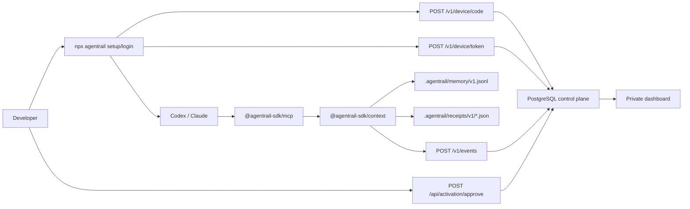
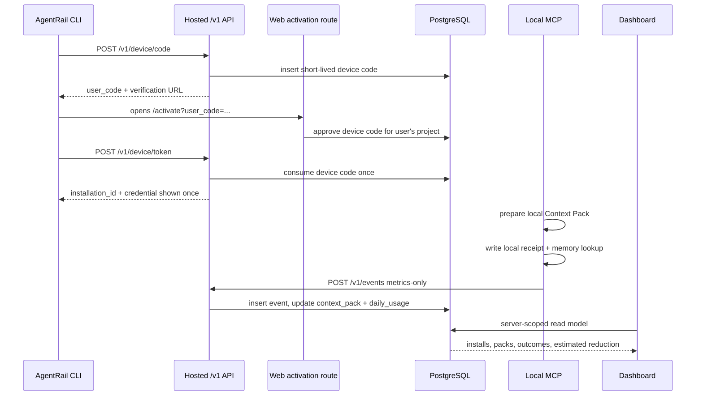
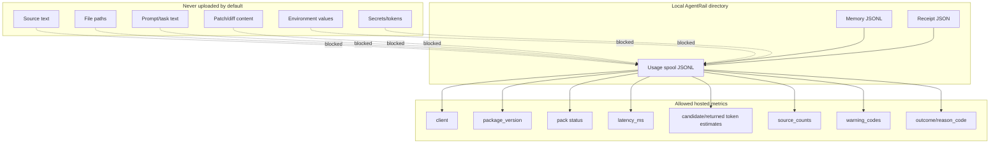

# AgentRail Activation Context API Spine Implementation Plan

> **For agentic workers:** REQUIRED SUB-SKILL: Use superpowers:subagent-driven-development (recommended) or superpowers:executing-plans to implement this plan task-by-task. Steps use checkbox (`- [ ]`) syntax for tracking.

**Goal:** Make the first five AgentRail enhancements feel like one connected product: a developer installs AgentRail, generates useful Context Packs locally, keeps project memory locally, records receipts, and sees private activation/token metrics in the hosted dashboard.

**Architecture:** AgentRail remains local-first: MCP and CLI do useful work even with no account, no network, and no daemon. The hosted backend is an optional control plane for device activation, installation identity, metrics-only usage events, and private dashboards. No source text, prompts, patches, paths, environment values, or secrets are uploaded in the default hosted mode.

**Tech Stack:** Node.js 24, pnpm 11, TypeScript 5.9, MCP TypeScript SDK, Hono, Next.js App Router, React, Drizzle ORM, PostgreSQL/RDS, Redis Streams or SQS, Vercel for the web shell, AWS reference backend, Vitest, Playwright.

## Global Constraints

- Package names stay under `@agentrail-sdk/*`.
- Context Relay works in `local-only` mode without login, Docker, cloud API, or internet.
- Hosted activation uses `POST /v1/device/code`, `POST /api/activation/approve`, and `POST /v1/device/token`.
- Hosted usage uses `POST /v1/events` and accepts only the metrics allowlist.
- Browser code never accesses the database, queue, credential digest, private object storage, or raw local source files directly.
- Dashboard numbers must be labeled as private, estimated, or unavailable when they are not backed by accepted usage events.
- Do not claim active users, traction, token savings, or AWS acceptance unless there is observed evidence.
- Production is not considered complete while `/v1/device/code`, `/v1/device/token`, and `/v1/events` return configuration-level `503`.

---

## Product Spine

The five requested enhancements should not feel like five separate features. They should become one loop:

1. `npx agentrail setup` installs AgentRail into Codex or Claude.
2. `npx agentrail login` connects that local install to an AgentRail account.
3. The AI calls `agentrail_prepare_context` before coding.
4. AgentRail returns a budgeted Context Pack and writes local memory/receipt evidence.
5. Safe usage metrics are flushed to the backend.
6. The dashboard shows installs, Context Packs, outcomes, and estimated token reduction.



## Feature-to-API Map

| Priority | Enhancement          | Local surface                                                                               | Backend/API surface                                                                                    | Dashboard proof                                    | Current status                                                        |
| -------- | -------------------- | ------------------------------------------------------------------------------------------- | ------------------------------------------------------------------------------------------------------ | -------------------------------------------------- | --------------------------------------------------------------------- |
| 1        | Hosted activation    | `agentrail login`, credential store, managed MCP config                                     | `POST /v1/device/code`, `POST /api/activation/approve`, `POST /v1/device/token`, `installations` table | Connected installs, stale installs, privacy mode   | Implemented in code; production still needs DB/auth/env green         |
| 2        | Context Pack MCP     | `agentrail_prepare_context`                                                                 | Optional `POST /v1/events` after pack creation                                                         | Pack count, source mix, warning codes              | Implemented and published; hosted metrics depend on activation        |
| 3        | Local project memory | `agentrail_remember`, `agentrail_recall`, `.agentrail/memory/v1.jsonl`                      | No cloud API by default                                                                                | Memory enabled indicator only, not memory content  | Implemented locally; hosted sync intentionally excluded               |
| 4        | Context receipts     | `.agentrail/receipts/v1/<packId>.json`, `agentrail_report_outcome`                          | `POST /v1/events` for outcome metrics; future `POST /v1/receipts` only for opt-in redacted sharing     | Outcome rate and latest receipt metadata           | Local receipt implemented; hosted private receipt share remains M3    |
| 5        | Token budget report  | `measurement.candidateTokensEstimate`, `returnedTokensEstimate`, `contextReductionEstimate` | Safe metric fields in `POST /v1/events`                                                                | Estimated reduction, packs per user, warning trend | Implemented locally; dashboard aggregation depends on accepted events |

## Backend Direction Diagram



## Privacy Boundary Diagram



## Current Code Anchors

| Area                      | Files that already exist                                                                                                                                                          |
| ------------------------- | --------------------------------------------------------------------------------------------------------------------------------------------------------------------------------- |
| Hosted `/v1` web bridge   | `apps/web/app/v1/[...path]/route.ts`, `apps/web/lib/hosted-ingest.ts`, `apps/web/tests/hosted-ingest.test.ts`                                                                     |
| Device activation         | `apps/ingest/src/device.ts`, `apps/ingest/src/device.test.ts`, `apps/web/lib/activation.ts`, `apps/web/app/api/activation/approve/route.ts`, `packages/cli/src/commands/login.ts` |
| Usage events              | `apps/ingest/src/usage-events.ts`, `apps/ingest/src/usage-events.test.ts`, `packages/context/src/spool-flush.ts`, `packages/context/src/spool-flush.test.ts`                      |
| Context Pack MCP          | `packages/context/src/pack.ts`, `packages/mcp/src/context-tools.ts`, `packages/mcp/src/server.ts`                                                                                 |
| Local memory and receipts | `packages/context/src/pack.ts`, `.agentrail/memory/v1.jsonl`, `.agentrail/receipts/v1/*.json`                                                                                     |
| Dashboard read models     | `apps/web/lib/product-read-model.ts`, `apps/web/lib/admin-analytics.ts`, `apps/web/components/product/*`, `apps/web/components/admin/*`                                           |

## Task 1: Make Hosted Activation Production-Green

**Files:**

- Modify: `.env.example`
- Modify: `docs/deployment/aws-control-plane.md`
- Modify: `docs/deployment/aws.md`
- Modify: `scripts/verify-production.ts`
- Test: `apps/web/tests/hosted-ingest.test.ts`
- Test: `apps/ingest/src/device.test.ts`
- Test: `apps/ingest/src/usage-events.test.ts`

**Interfaces:**

- Consumes: `createProductionHostedIngestApp()` from `apps/web/lib/hosted-ingest.ts`.
- Produces: production `/v1/device/code`, `/v1/device/token`, and `/v1/events` responses that are not configuration-level `503`.

- [ ] **Step 1: Add production smoke assertions**

  Add checks to `scripts/verify-production.ts` that call:

  ```text
  GET /
  POST /v1/device/code
  POST /v1/events
  ```

  Expected behavior:

  - `/` returns `200`.
  - `/v1/device/code` returns either `200` with device code or a non-configuration auth/rate-limit error.
  - `/v1/events` returns `401` without a bearer credential, not `503 service_unavailable`.

- [ ] **Step 2: Verify RED against missing production env**

  Run:

  ```powershell
  rtk pnpm test:production -- --url https://agentrail.id
  ```

  Expected: fails specifically because hosted control-plane env/database/queue are not configured.

- [ ] **Step 3: Document exact required env**

  Update deployment docs with the minimum production env set:

  ```text
  DATABASE_URL
  BETTER_AUTH_SECRET
  BETTER_AUTH_URL
  GITHUB_CLIENT_ID
  GITHUB_CLIENT_SECRET
  INSTALLATION_CREDENTIAL_PEPPER
  API_KEY_PEPPER
  REDIS_URL or AGENTRAIL_SPAN_QUEUE_URL
  NEXT_PUBLIC_AGENTRAIL_SITE_URL=https://agentrail.id
  AGENTRAIL_ACTIVATION_BASE_URL=https://agentrail.id/activate
  ```

- [ ] **Step 4: Configure production env outside code**

  Add the env values in Vercel or the AWS-hosted control plane. Do not commit secrets.

- [ ] **Step 5: Verify GREEN**

  Run:

  ```powershell
  rtk pnpm vitest run apps/web/tests/hosted-ingest.test.ts apps/ingest/src/device.test.ts apps/ingest/src/usage-events.test.ts
  rtk pnpm test:production -- --url https://agentrail.id
  ```

  Expected: all tests pass; production `/v1/events` without credentials returns `401`, not `503`.

## Task 2: Connect Dashboard Metrics to Real Usage Events

**Files:**

- Modify: `apps/web/lib/product-read-model.ts`
- Modify: `apps/web/lib/admin-analytics.ts`
- Modify: `apps/web/app/(product)/dashboard/page.tsx`
- Modify: `apps/web/app/(admin)/admin/analytics/page.tsx`
- Test: `apps/web/lib/product-read-model.integration.test.ts`
- Test: `apps/web/lib/admin-analytics.integration.test.ts`
- Test: `tests/e2e-cloud/activation-metrics.e2e.test.ts`

**Interfaces:**

- Consumes: accepted rows from `usage_events`, `context_packs`, `daily_usage`, and `installations`.
- Produces: private user metrics and founder analytics from the same accepted event definitions.

- [ ] **Step 1: Add fixtures that simulate one install and two packs**

  Seed:

  ```text
  user -> project -> installation -> context_pack_created event x2 -> context_outcome_reported event x1
  ```

- [ ] **Step 2: Verify RED on any missing read-model linkage**

  Run:

  ```powershell
  rtk pnpm vitest run apps/web/lib/product-read-model.integration.test.ts apps/web/lib/admin-analytics.integration.test.ts tests/e2e-cloud/activation-metrics.e2e.test.ts
  ```

- [ ] **Step 3: Ensure all dashboard cards use accepted events only**

  User dashboard fields:

  ```text
  connectedClients
  packs7d
  packs30d
  contextReductionEstimate30d
  reuseRate30d
  latestError
  nextAction
  ```

  Founder dashboard fields:

  ```text
  authenticatedUsers
  activatedInstallations
  activeUsers7d
  activeUsers30d
  firstPackConversion
  packsPerActiveUser30d
  npmDownloads
  ```

- [ ] **Step 4: Verify GREEN**

  Run:

  ```powershell
  rtk pnpm vitest run apps/web/lib/product-read-model.integration.test.ts apps/web/lib/admin-analytics.integration.test.ts tests/e2e-cloud/activation-metrics.e2e.test.ts
  rtk pnpm --filter @agentrail-sdk/web build
  ```

## Task 3: Make Context Pack MCP the Default Product Story

**Files:**

- Modify: `packages/mcp/src/profile.ts`
- Modify: `packages/mcp/src/context-tools.ts`
- Modify: `packages/cli/src/commands/doctor.ts`
- Modify: `docs/operations/mcp.md`
- Test: `packages/mcp/src/profile.test.ts`
- Test: `packages/mcp/src/context-tools.test.ts`
- Test: `packages/cli/src/commands/doctor.test.ts`

**Interfaces:**

- Consumes: `createContextRelay()` from `packages/context/src/pack.ts`.
- Produces: a default MCP profile where the obvious first tool is `agentrail_prepare_context`.

- [ ] **Step 1: Assert default MCP tool list**

  Required default tools:

  ```text
  agentrail_prepare_context
  agentrail_recall
  agentrail_remember
  agentrail_report_outcome
  ```

- [ ] **Step 2: Verify RED if default profile drifts**

  Run:

  ```powershell
  rtk pnpm vitest run packages/mcp/src/profile.test.ts packages/mcp/src/context-tools.test.ts packages/cli/src/commands/doctor.test.ts
  ```

- [ ] **Step 3: Update CLI doctor copy**

  The doctor output must explain:

  ```text
  AgentRail is installed.
  Your AI can now call agentrail_prepare_context before a coding task.
  Login is optional; local context still works offline.
  ```

- [ ] **Step 4: Verify GREEN**

  Run:

  ```powershell
  rtk pnpm vitest run packages/mcp/src/profile.test.ts packages/mcp/src/context-tools.test.ts packages/cli/src/commands/doctor.test.ts
  rtk pnpm --filter @agentrail-sdk/mcp build
  rtk pnpm --filter @agentrail-sdk/cli build
  ```

## Task 4: Make Local Memory and Receipts Visible Without Uploading Source

**Files:**

- Modify: `packages/context/src/pack.ts`
- Modify: `packages/context/src/types.ts`
- Modify: `docs/operations/mcp.md`
- Test: `packages/context/src/pack.test.ts`
- Test: `packages/context/src/contracts.test.ts`

**Interfaces:**

- Consumes: `.agentrail/memory/v1.jsonl` and `.agentrail/receipts/v1/*.json`.
- Produces: Context Pack output that clearly tells the AI which project rules and receipts were used.

- [ ] **Step 1: Add receipt and memory visibility assertions**

  Test that `agentrail_prepare_context` returns:

  ```text
  packId
  selected context files/chunks
  local memory decisions
  warnings
  token estimates
  receipt location or null hosted receipt URL
  ```

- [ ] **Step 2: Verify RED against missing visibility fields**

  Run:

  ```powershell
  rtk pnpm vitest run packages/context/src/pack.test.ts packages/context/src/contracts.test.ts
  ```

- [ ] **Step 3: Keep hosted receipt URL null until evidence sync is explicit**

  Default behavior:

  ```text
  receiptUrl: null
  local file: .agentrail/receipts/v1/<packId>.json
  ```

- [ ] **Step 4: Verify GREEN**

  Run:

  ```powershell
  rtk pnpm vitest run packages/context/src/pack.test.ts packages/context/src/contracts.test.ts
  rtk pnpm --filter @agentrail-sdk/context build
  ```

## Task 5: Make Token Budget Report Easy to Understand

**Files:**

- Modify: `packages/context/src/pack.ts`
- Modify: `apps/web/components/product/metric-strip.tsx`
- Modify: `apps/web/components/admin/analytics-ledger.tsx`
- Modify: `docs/operations/mcp.md`
- Test: `packages/context/src/tokens.test.ts`
- Test: `packages/context/src/pack.test.ts`
- Test: `apps/web/lib/product-read-model.integration.test.ts`

**Interfaces:**

- Consumes: `candidateTokensEstimate`, `returnedTokensEstimate`, and `contextReductionEstimate`.
- Produces: local MCP output and dashboard labels that say `estimated`, not guaranteed savings.

- [ ] **Step 1: Add clear estimate contract**

  The Context Pack measurement must include:

  ```json
  {
    "candidateTokensEstimate": 12000,
    "returnedTokensEstimate": 3000,
    "contextReductionEstimate": 75,
    "method": "heuristic-v1",
    "confidence": "estimated"
  }
  ```

- [ ] **Step 2: Verify RED if dashboard hides estimate status**

  Run:

  ```powershell
  rtk pnpm vitest run packages/context/src/tokens.test.ts packages/context/src/pack.test.ts apps/web/lib/product-read-model.integration.test.ts
  ```

- [ ] **Step 3: Update UI copy**

  Dashboard labels should say:

  ```text
  Estimated context reduction
  Based on local heuristic token estimates from accepted Context Pack events.
  ```

- [ ] **Step 4: Verify GREEN**

  Run:

  ```powershell
  rtk pnpm vitest run packages/context/src/tokens.test.ts packages/context/src/pack.test.ts apps/web/lib/product-read-model.integration.test.ts
  rtk pnpm --filter @agentrail-sdk/web build
  ```

## End-to-End Acceptance Gate

Before this spine is called production-ready:

- [ ] `npm install @agentrail-sdk/cli @agentrail-sdk/context @agentrail-sdk/mcp` works in a clean folder.
- [ ] `npx agentrail setup --client codex --root <repo>` creates or updates client config with backup.
- [ ] `npx agentrail login --api-url https://agentrail.id --client codex --root <repo>` completes device activation.
- [ ] Codex can call `agentrail_prepare_context` and receive a Context Pack.
- [ ] `.agentrail/memory/v1.jsonl` is used locally.
- [ ] `.agentrail/receipts/v1/<packId>.json` is written locally.
- [ ] `/v1/events` receives only metrics-safe fields.
- [ ] User dashboard shows one activated install and at least one Context Pack.
- [ ] Founder analytics derives active installs/users from accepted events, not npm downloads.
- [ ] Production smoke proves `/v1` is configured and no longer returns configuration-level `503`.

## Self-Review

- Spec coverage: all five requested enhancements map to one local surface, one backend/API boundary where applicable, and one dashboard proof point.
- Placeholder scan: there are no intentionally unfinished placeholders in the plan.
- Type consistency: route names and tool names match the current code anchors listed above.
- Scope control: hosted private receipt sharing and GitHub PR receipts remain outside this five-feature spine unless explicitly selected later.
