# AgentRail Context Relay System Design

**Status:** Approved design  
**Date:** 2026-07-29  
**Audience:** AgentRail maintainers, founding testers, and implementation reviewers

## 1. Decision summary

AgentRail will evolve from a passive flight recorder into a local-first Context
Relay for individual developers using coding agents.

The product promise is:

> Give a coding agent the smallest trustworthy context for a task, then prove
> which sources it used.

The existing forensic pipeline remains part of the product. Context Relay adds
value before and during a coding task. Trace Rail, Action Ledger, and Evidence
Drawer prove what happened afterward.

The first target user is an individual developer using Codex, Claude Code,
Cursor, VS Code, or Gemini CLI. Team features, billing, and broad enterprise
governance remain outside this milestone.

## 2. Why this direction

Read-only trace inspection is useful after a failure but does not create a
strong daily adoption loop. Context Relay creates immediate value inside the
developer's AI client:

1. prepare task-relevant context;
2. keep the result within a declared token budget;
3. include source provenance and freshness;
4. recall relevant project decisions;
5. produce a private Context Receipt;
6. record safe usage metadata for user and founder analytics.

Monitoring becomes evidence generated as a byproduct of a useful workflow
instead of the only reason to install AgentRail.

## 3. Goals

- Provide a useful local Context Pack without requiring a hosted account.
- Install into supported coding-agent clients through one guided CLI.
- Keep source code, prompts, secrets, and file contents local by default.
- Produce citations, content hashes, selection reasons, and freshness status.
- Maintain a small default MCP tool surface.
- Provide lightweight project memory with explicit provenance.
- Produce private Context Receipts and link them to forensic traces.
- Give each authenticated user project-scoped usage analytics.
- Give the founder aggregate product analytics based on real usage events.
- Preserve existing `/traces` and `/traces/[traceId]` URLs.
- Map the hosted path to a cost-conscious AWS architecture.
- Remain functional when the AgentRail hosted service is unavailable.

## 4. Non-goals

- Instrument every Codex or Claude interaction automatically.
- Capture full chat history.
- Upload repositories for remote indexing by default.
- Replace Context7, Graphiti, language servers, or code search tools.
- Promise support for AI clients that have not passed compatibility tests.
- Claim exact token or cost savings when only an estimate is available.
- Add team billing, enterprise RBAC, SSO, or organization administration.
- Add an always-on local file watcher.
- Require Docker, PostgreSQL, a graph database, embeddings, or an LLM for the
  local Context Relay.
- Expose source blobs directly from browser code.
- Show fabricated public user counters or traction.

## 5. Product boundary

AgentRail consists of two independently useful planes:

1. **Local plane**
   - universal installer;
   - client adapters;
   - MCP server;
   - local scanner and incremental index;
   - Context Pack assembly;
   - local project memory;
   - local telemetry spool.
2. **Hosted plane**
   - authentication and device activation;
   - project and installation identity;
   - metrics ingestion;
   - private Context Receipts;
   - optional redacted evidence sync;
   - user dashboard;
   - founder analytics;
   - existing forensic trace dashboard.

The local plane must remain usable without the hosted plane.

## 6. System context

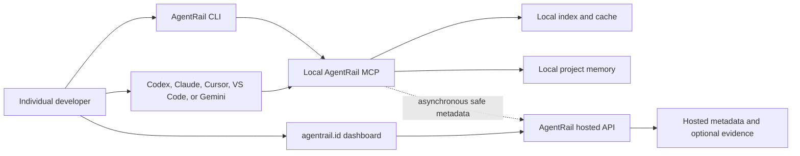

## 7. Client compatibility strategy

MCP is the common capability layer, but each client has different configuration
and durable-instruction surfaces. AgentRail must use per-client adapters rather
than assuming that one configuration file works everywhere.

### 7.1 First-class clients

| Client              | MCP transport | Instruction adapter                           | Verification                         |
| ------------------- | ------------- | --------------------------------------------- | ------------------------------------ |
| Codex App, CLI, IDE | local stdio   | AgentRail skill plus server instructions      | `codex mcp list` and MCP handshake   |
| Claude Code         | local stdio   | Claude rule or skill plus server instructions | `claude mcp list` and MCP handshake  |
| Cursor              | local stdio   | Cursor rule plus server instructions          | config parse and tool discovery      |
| VS Code/Copilot     | local stdio   | MCP profile or workspace instructions         | MCP server status and tool discovery |
| Gemini CLI          | local stdio   | Gemini instruction plus server instructions   | `gemini mcp list` and MCP handshake  |

### 7.2 Generic and unsupported clients

- Generic MCP clients receive generated JSON, TOML, or command examples.
- AI clients without MCP use the `agentrail context` CLI command.
- A client is not advertised as supported until its setup, verification, and
  uninstall flows pass on a supported operating system.

### 7.3 Installation principles

- The installer detects clients but never modifies all detected clients without
  explicit selection.
- Existing configuration is parsed before modification.
- A timestamped backup is written before every mutation.
- Setup is idempotent.
- Uninstall removes only AgentRail-owned entries.
- Rollback restores the exact pre-install configuration when possible.
- Secrets are never written into a repository.
- Project-scoped configuration requires explicit user choice.

## 8. Installation and activation flow

The target command is:

```bash
npx @agentrail-sdk/cli setup
```

The local benefit does not require login. Login is requested when the user
chooses cloud receipts, analytics, or optional evidence sync.

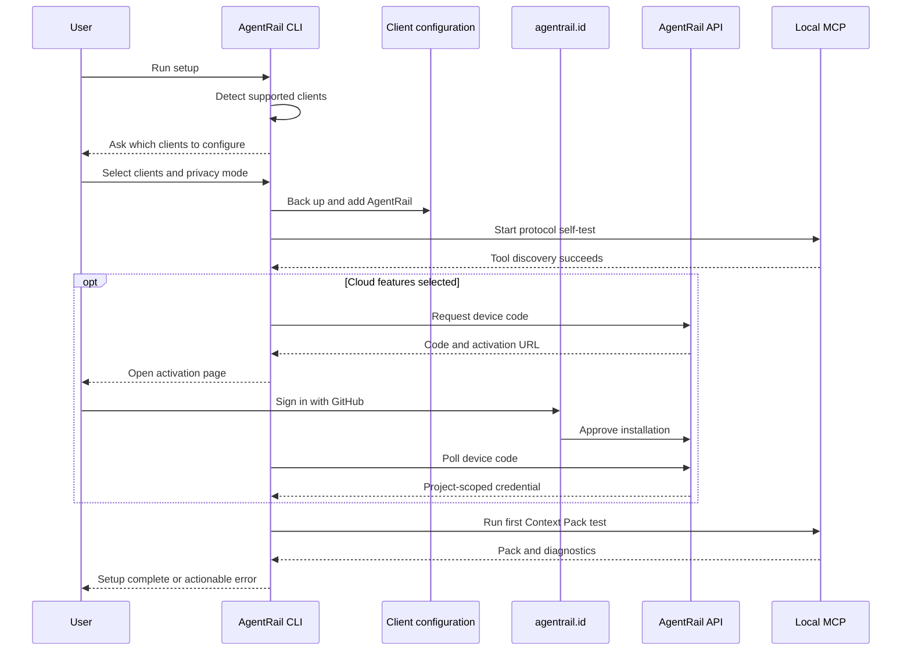

### 8.1 CLI commands

```text
agentrail setup
agentrail login
agentrail context "<task>" --budget 4000
agentrail doctor
agentrail status
agentrail update
agentrail logout
agentrail uninstall
```

`doctor` verifies:

- Node and package compatibility;
- selected workspace root;
- client configuration parse;
- MCP initialization and tool discovery;
- local cache write permission;
- privacy-mode configuration;
- hosted authentication when enabled;
- telemetry queue state;
- package version and upgrade status.

## 9. Default MCP tool contract

The default Context Relay profile registers four tools. A small tool surface
reduces schema overhead and tool-selection ambiguity.

### 9.1 `agentrail_prepare_context`

Purpose: produce a task-specific Context Pack within a declared budget.

Input:

```json
{
  "task": "Add OAuth login without changing the current session model",
  "tokenBudget": 4000,
  "focus": ["auth", "tests"],
  "exclude": ["generated", "fixtures"]
}
```

Required output fields:

```json
{
  "packId": "cp_example",
  "status": "ready",
  "context": [],
  "decisions": [],
  "warnings": [],
  "measurement": {
    "candidateTokensEstimate": 12600,
    "returnedTokensEstimate": 3780,
    "contextReductionEstimate": 8820,
    "method": "heuristic-v1",
    "confidence": "estimated"
  },
  "receiptUrl": null
}
```

`receiptUrl` is null in local-only mode.

When cloud receipts are enabled, the local MCP generates a high-entropy receipt
ID and can construct the private URL without waiting for the hosted API. The
receipt initially has a `pending-sync` state. It becomes available after the
background event is accepted. Opening an unknown or unsynchronized ID returns a
generic authenticated pending/not-found state and reveals no project metadata.

### 9.2 `agentrail_recall`

Purpose: retrieve active decisions, constraints, rejected approaches, and known
risks relevant to a query.

Inputs:

- `query: string`;
- `scope?: string`;
- `limit?: number`;
- `at?: string` for historical lookup.

Every result includes provenance, status, and optional expiry.

### 9.3 `agentrail_remember`

Purpose: store a structured project decision locally.

This is a write tool. It must be marked non-destructive and non-read-only in MCP
metadata so clients can apply their approval policy.

Inputs:

- `type`;
- `statement`;
- `scope`;
- `source`;
- `status`;
- optional `expiresAt`.

It never stores full chat history.

### 9.4 `agentrail_report_outcome`

Purpose: associate user feedback or task outcome with a Context Pack.

Inputs:

- `packId`;
- `outcome: "helpful" | "partial" | "missed" | "failed"`;
- optional bounded reason code;
- optional changed-file count;
- optional trace ID.

Raw prompts, patches, and file contents are excluded from the default event.

### 9.5 Forensics profile

The existing read-only tools remain available through the optional
`context+forensics` profile:

- `agentrail_list_traces`;
- `agentrail_get_trace`;
- `agentrail_get_actions`;
- `agentrail_get_payload_status`;
- `agentrail_open_dashboard`.

The installer enables only the profile selected by the user. Compatibility and
migration notes must explain the profile change.

## 10. Context preparation pipeline

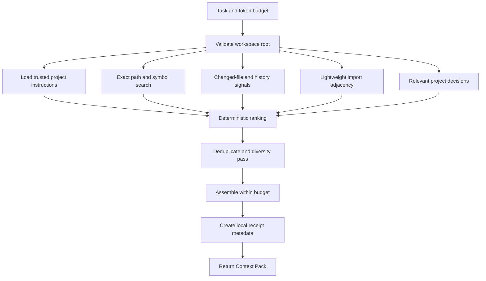

### 10.1 Candidate discovery

Version one uses deterministic local signals:

- exact path and symbol matches;
- lexical relevance;
- language-aware headings and declaration boundaries;
- import and dependency adjacency;
- Git changed-file signals;
- nearby tests;
- trusted repository instructions;
- project memory;
- freshness;
- source-type priority.

Embeddings and LLM reranking are deferred until a benchmark demonstrates an
improvement over this baseline.

### 10.2 Source trust

Sources are classified:

- `trusted_instruction`: explicitly supported instruction files such as
  `AGENTS.md`;
- `project_source`: source and test files;
- `project_documentation`: repository documentation;
- `external_documentation`: explicitly requested network source;
- `untrusted_content`: generated files, copied output, issue bodies, and other
  content that may contain prompt injection.

Text inside ordinary source files is treated as data, not as AgentRail
instructions.

The initial local milestone indexes repository files, project documentation,
trusted instructions, and project memory. Arbitrary external URL fetching is
disabled until a separate connector design covers SSRF protection, redirect
limits, content-size limits, caching, provenance, and prompt-injection handling.

### 10.3 Context item contract

Every returned item contains:

- repository-relative path or stable source identifier;
- symbol or line locator;
- content hash;
- source trust class;
- relevance reason;
- relevance score;
- freshness timestamp;
- estimated tokens;
- truncation status.

Absolute paths are never sent to the hosted service.

## 11. Token measurement

AgentRail must not present an estimate as a measured saving.

Stored fields:

- `candidate_tokens_estimate`;
- `returned_tokens_estimate`;
- `context_reduction_estimate`;
- `measurement_method`;
- optional `model`;
- optional `tokenizer`;
- `confidence`.

`context_reduction_estimate` is the difference between the candidate set
considered by AgentRail and the returned pack. It is not the size of the entire
repository and is not an exact monetary saving.

When a compatible model tokenizer is configured, AgentRail may report a
model-specific measurement. Otherwise it uses a documented deterministic
heuristic and labels the result `estimated`.

## 12. Local index and cache

### 12.1 Requirements

- no scan during MCP startup;
- lazy build on the first context request;
- incremental updates keyed by metadata and content hash;
- no native dependency;
- no graph database;
- no Docker requirement;
- no always-on watcher;
- cache corruption must cause a bounded rebuild, not an MCP crash.

### 12.2 Default limits

| Resource                              | Default                         |
| ------------------------------------- | ------------------------------- |
| Source files                          | 10,000                          |
| Individual file                       | 1 MB                            |
| Cache per repository                  | 200 MB                          |
| Warm request p95 target               | below 1.5 seconds               |
| Cold request deadline                 | 5 seconds before partial result |
| MCP startup target                    | below 250 ms                    |
| Memory target for a medium repository | below 150 MB                    |

Limits are configurable. Hitting a limit returns a warning and partial result
rather than silently ignoring the condition.

### 12.3 Ignore behavior

AgentRail respects:

- `.gitignore`;
- `.agentrailignore`;
- dependency directories;
- build output;
- binary detection;
- known secret file patterns;
- explicit include and exclude options.

Symlinks that resolve outside the workspace root are rejected.

## 13. Project memory

Project memory stores durable, reviewable statements:

- architecture decisions;
- constraints;
- conventions;
- rejected approaches;
- known risks;
- temporary workarounds;
- review or expiry dates;
- provenance.

Default storage is local and human-readable under `.agentrail/`. Teams may
choose whether to ignore or version the directory. Cloud sync is opt-in.

Memory states:

- `active`;
- `superseded`;
- `expired`;
- `review_required`;
- `deleted`.

AgentRail must not silently convert model output into durable memory. A write
requires an explicit tool call and client approval.

## 14. Hosted authentication and installation identity

### 14.1 Identity

- GitHub is the first web sign-in provider.
- A hosted user can own one or more projects.
- A local installation receives a revocable, project-scoped credential.
- Credentials are never returned by dashboard read routes after issuance.
- Secure platform credential storage is preferred.
- A permission-restricted file is the fallback when a platform credential
  store is unavailable.

### 14.2 Device activation

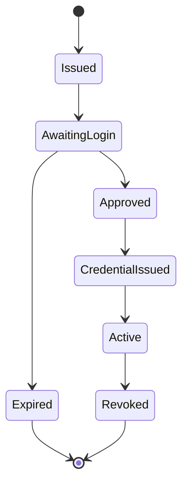

The activation page must handle invalid, expired, already approved, and revoked
states explicitly.

## 15. Privacy modes and data flow

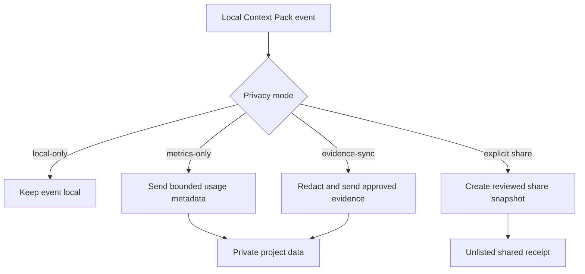

### 15.1 Local-only

- no cloud receipt;
- no usage event;
- no founder active-user count;
- local Context Relay remains fully functional.

### 15.2 Metrics-only

Default after a user enables cloud features:

- installation ID;
- project ID;
- client and version;
- operation status;
- latency;
- estimated candidate and returned tokens;
- source counts by class;
- warning codes;
- bounded outcome code.

Excluded:

- task text;
- prompt text;
- file contents;
- absolute or relative file paths;
- source snippets;
- environment values;
- secrets.

### 15.3 Evidence sync

Opt-in per project. Relative citations and redacted source excerpts may be
stored. The backend owns evidence access. Browser code never reads object
storage directly.

### 15.4 Shared receipt

Private by default. Sharing requires:

1. selecting a receipt;
2. reviewing included fields;
3. running redaction;
4. confirming publication;
5. receiving a revocable unlisted token.

## 16. Cloud event pipeline

Cloud telemetry must never block a Context Pack response.

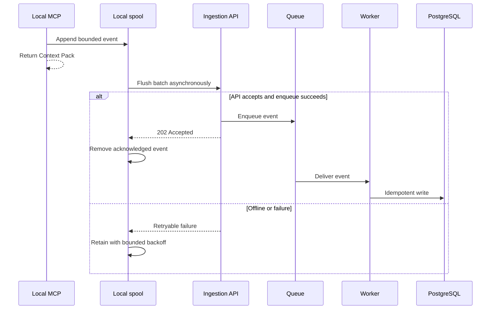

The ingestion endpoint returns `202 Accepted` only after a fast enqueue. The
response is from the API to the local client, not a queue-to-client flow.

Idempotency uses `(installation_id, event_id)`.

Every event includes an explicit schema version. The local spool has a bounded
size and age. Its proposed defaults are 10 MB and seven days. When the limit is
reached, AgentRail drops the oldest metrics-only events, records a local
overflow warning, and never blocks Context Pack generation.

## 17. Hosted data model

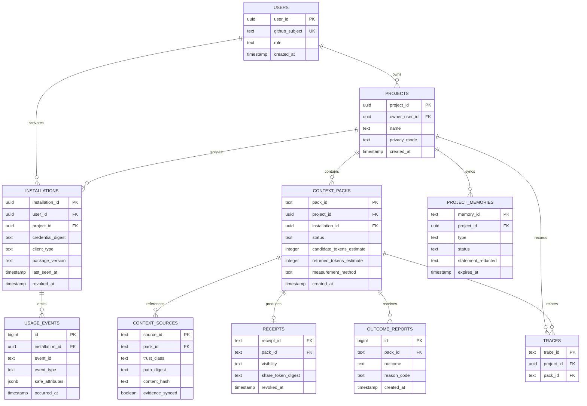

Task text is not required for metrics-only context packs. A local task label may
be represented in the hosted dashboard as an explicit user-supplied label or a
non-reversible digest.

## 18. Analytics definitions

Definitions must be stable and documented:

- **Authenticated user:** a distinct hosted account.
- **Activated installation:** an installation that completed device activation
  and a successful connection test.
- **Active user 7d/30d:** a distinct authenticated user that produced at least
  one accepted Context Pack event in the period.
- **First-pack conversion:** activated installations with a first successful
  Context Pack divided by activated installations.
- **Weekly retained user:** a user active in the previous weekly cohort and
  active again in the selected week.
- **Pack reuse rate:** packs using at least one cached source divided by
  successful packs.
- **Context reduction estimate:** aggregate estimated candidate tokens minus
  estimated returned tokens, always labeled estimated.

Npm downloads are displayed separately and never labeled active users.

## 19. Frontend information architecture

Existing trace URLs remain stable.

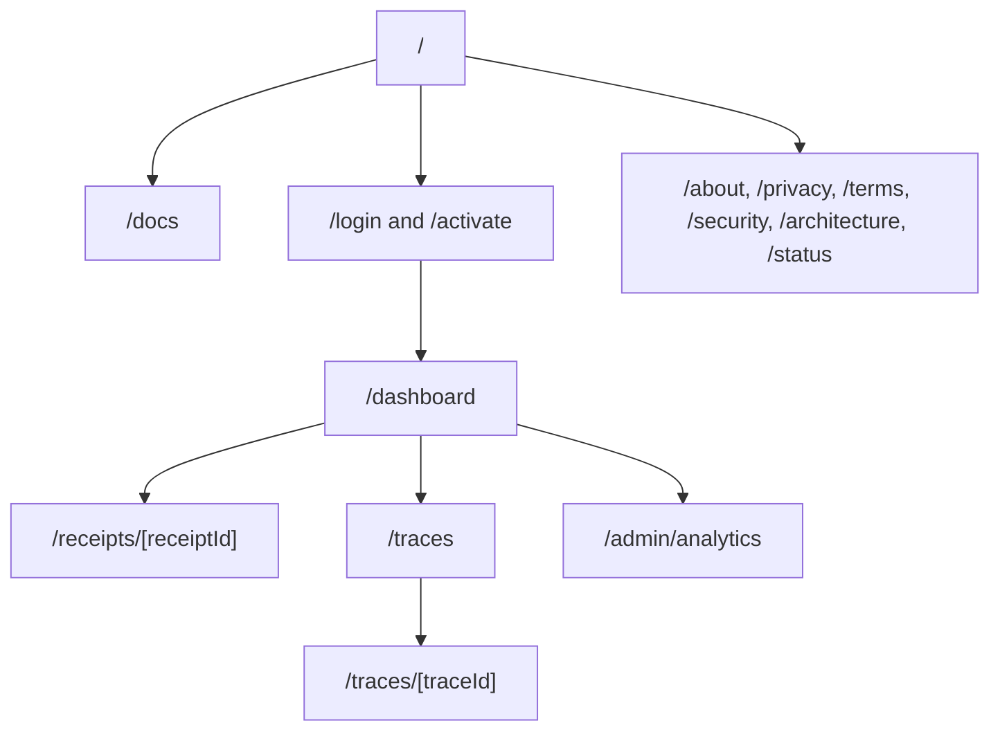

### 19.1 Landing page `/`

Design read: B2B developer-tool landing for individual AI builders with a
serious forensic language and a restrained Linear-style composition.

Landing-only dials:

- `DESIGN_VARIANCE: 6`;
- `MOTION_INTENSITY: 4`;
- `VISUAL_DENSITY: 4`.

Required changes:

- lead with Context Relay value;
- use a real Context Receipt screenshot;
- make the universal install command the primary action;
- show only tested client support;
- explain local-first privacy;
- link to a real demo and documentation;
- move grant-oriented AWS copy to `/architecture`;
- update npm status to live;
- avoid fabricated social proof.

The landing keeps the existing graphite, warm-white, amber palette, Instrument
Sans, JetBrains Mono, Phosphor icons, small radii, and limited shadows. It does
not use AI-purple gradients, glassmorphism, robot illustrations, decorative
loops, or three equal feature cards.

### 19.2 Documentation

Routes:

- `/docs/quickstart`;
- `/docs/clients/codex`;
- `/docs/clients/claude`;
- `/docs/clients/cursor`;
- `/docs/clients/vscode`;
- `/docs/clients/gemini`;
- `/docs/privacy`;
- `/docs/troubleshooting`.

Displayed commands must be generated from tested fixtures or verified during
release. Documentation must not advertise a client before compatibility tests
pass.

### 19.3 Activation `/activate`

Required states:

- waiting for code;
- invalid code;
- expired code;
- login required;
- awaiting device poll;
- approved;
- already approved;
- revoked;
- service unavailable.

### 19.4 User overview `/dashboard`

Displays:

- Context Packs in 7 and 30 days;
- estimated context reduction;
- reuse rate;
- stale decisions;
- connected clients;
- latest error;
- next onboarding action when empty.

### 19.5 Context Packs `/dashboard/context-packs`

Server-paginated table with project, client, date, status, outcome, and warning
filters. Synthetic demo data and live project data never appear in the same
dataset.

### 19.6 Context Receipt `/receipts/[receiptId]`

Order:

1. task label when explicitly synced;
2. measurement;
3. source ledger;
4. selection reasons;
5. project decisions;
6. excluded or stale sources;
7. security warnings;
8. outcome;
9. related trace.

Source content loads on demand through authenticated backend routes.
Metrics-only receipts show measurement, source counts, warnings, client, and
outcome. They do not render a source ledger or selection details that were never
synced. Evidence-sync receipts add those sections only when stored evidence
exists.

### 19.7 Project Memory `/dashboard/memory`

Supports active, superseded, expired, and review-required records. Mutations
require confirmation and create an audit event.

### 19.8 Integrations `/dashboard/integrations`

Displays connected state, client, package version, last seen, privacy mode,
workspace count, last successful pack, and upgrade warnings.

Actions:

- copy setup command;
- show Doctor guidance;
- reconnect;
- rotate credential;
- revoke;
- show uninstall instructions.

### 19.9 Existing traces

`/traces` explains its role as post-task evidence. It links Context Packs to
agent runs. `/traces/[traceId]` keeps Trace Rail, What Happened, Action Ledger,
and Evidence Drawer while adding Context Pack and receipt relationships.

### 19.10 Privacy settings

`/dashboard/settings/privacy` displays the exact data inventory for the current
mode and provides export, retention, receipt visibility, sync, and deletion
controls.

### 19.11 Founder analytics

`/admin/analytics` is protected by server-side role authorization. It includes:

- authenticated users;
- activated installations;
- active users 7 and 30 days;
- first-pack conversion;
- weekly retention;
- packs per active user;
- client and version distribution;
- privacy-mode distribution;
- error rate;
- p95 latency;
- npm downloads as a separate acquisition signal.

## 20. Frontend state and test contract

Every data surface has:

- layout-specific loading skeleton;
- actionable empty state;
- permission-denied state;
- offline or queued-telemetry state;
- partial-index state;
- stale-client state;
- service-error state;
- retry action;
- read-only demo state;
- authenticated live state.

Every interactive control maps to a tested contract:

| UI action            | Required proof                             |
| -------------------- | ------------------------------------------ |
| Copy install command | clipboard test and visible feedback        |
| Activate device      | API integration and expiry test            |
| Connect client       | per-client configuration fixture           |
| Create Context Pack  | MCP integration test                       |
| Open receipt         | project-scope authorization test           |
| Filter Context Packs | URL-state and query test                   |
| Remember decision    | approval and persistence test              |
| Revoke installation  | credential rejection test                  |
| Change privacy mode  | event-contract test                        |
| Delete data          | confirmation and deletion integration test |
| View founder metrics | aggregation and authorization test         |

Unavailable functionality is labeled as roadmap and does not render an active
button.

## 21. Frontend performance and visual rules

- Server Components are the default for data pages.
- Client Components are isolated to filters, copy actions, dialogs, and small
  interactive regions.
- Context source content is loaded only when requested.
- Data tables use server-side pagination.
- Version one adds no large chart library.
- Indexing never runs in the browser.
- Source content is excluded from initial HTML.
- Landing targets LCP below 2.5 seconds, INP below 200 ms, and CLS below 0.1.
- All motion respects reduced-motion settings.
- Dashboard identity remains graphite, warm white, amber, information-dense,
  small-radius, and nearly shadowless.
- Landing-page design rules do not leak into dashboard data tables.

## 22. AWS deployment

The website can remain on Vercel during the first hosted milestone. AgentRail's
stateful backend maps to AWS so credits fund infrastructure that directly
supports the product.

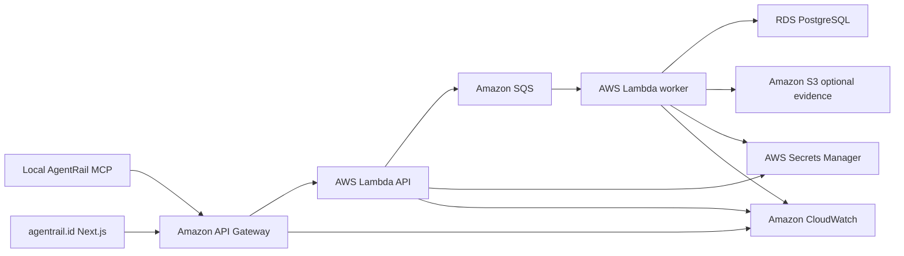

AWS rules:

- ingestion returns `202` only after a fast enqueue;
- processing happens in workers;
- secrets remain in Secrets Manager;
- evidence remains private in S3;
- browser access goes through authenticated backend routes;
- CloudWatch monitors queue depth, latency, errors, and worker failures;
- AWS Budgets and billing alarms are configured before beta traffic.

## 23. Milestones and dependency order

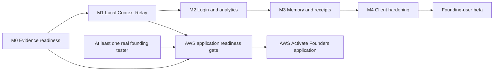

### 23.1 M0: Evidence readiness

- green CI;
- current npm and repository truth;
- public trust and legal pages;
- robots, sitemap, canonical, and social metadata;
- founding-tester intake;
- AWS application pack;
- public branch and README consistency.

### 23.2 M1: Local Context Relay

- CLI;
- Codex and Claude adapters;
- scanner and incremental index;
- Context Pack;
- token estimation;
- local spool;
- Doctor and uninstall.

### 23.3 M2: Login and analytics

- GitHub sign-in;
- device activation;
- installations and credentials;
- metrics-only ingestion;
- user overview;
- integrations;
- founder analytics.

### 23.4 M3: Memory and receipts

- recall;
- remember;
- report outcome;
- local memory;
- private receipts;
- optional evidence sync;
- receipt-to-trace links.

### 23.5 M4: Client and beta hardening

- Cursor, VS Code, and Gemini adapters;
- migration and rollback;
- accessibility and mobile review;
- privacy export and deletion;
- beta documentation and operations.

The AWS Activate Founders application may proceed after M0 is green, M1 works
end to end, at least one founding tester produces a real Context Pack, the AWS
application pack is complete, and the AWS Paid Tier account is ready. Full M4
completion is not required.

## 24. Test and release pipeline

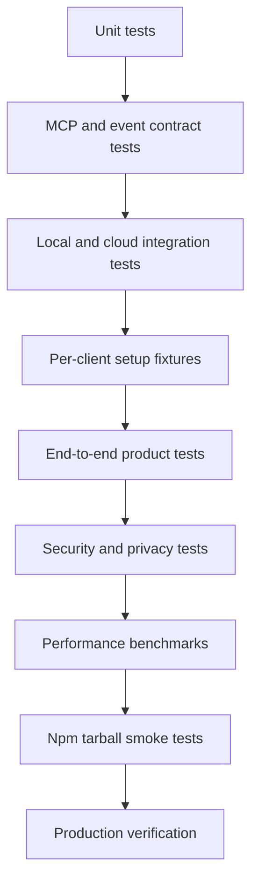

### 24.1 Unit tests

- ranking and tie-breaking;
- budget enforcement;
- deduplication;
- token estimation;
- redaction;
- ignore rules;
- path normalization;
- memory lifecycle;
- analytics aggregation.

### 24.2 Contract tests

- exact default MCP tool list;
- MCP schemas and annotations;
- usage-event schema;
- privacy-mode field allowlists;
- activation API;
- receipt read model;
- idempotency.

### 24.3 Integration tests

- fixture repository to Context Pack;
- partial cold index;
- local spool and later flush;
- queue and worker;
- project isolation;
- credential rotation and revocation;
- receipt-to-trace relation.

### 24.4 Client setup fixtures

For every advertised client:

- clean configuration;
- existing unrelated server;
- existing AgentRail entry;
- malformed configuration;
- setup twice;
- rollback;
- uninstall;
- Windows path;
- POSIX path.

### 24.5 Security tests

- path traversal;
- symlink escape;
- binary and secret exclusion;
- embedded prompt injection;
- absolute-path leakage;
- cross-project receipt access;
- revoked credential;
- share-token revocation;
- evidence endpoint authorization.

### 24.6 Npm release tests

- install in a clean temporary directory;
- import package exports;
- run CLI executable;
- perform MCP initialization;
- discover expected tools;
- confirm no `workspace:*` dependency;
- verify package provenance and checksum where supported.

## 25. Benchmark plan

The benchmark must protect answer quality while measuring context reduction.

Initial dataset:

- at least 30 coding tasks;
- multiple fixture repositories;
- gold-required files for every task;
- with-Relay and baseline runs;
- fixed model and settings for each comparison.

Release targets:

- gold-required-file recall at least 90%;
- task success no more than five percentage points below baseline;
- median returned context smaller than the candidate set;
- zero fixture-secret leakage;
- warm Context Pack p95 below 1.5 seconds;
- cold request returns a full or labeled partial result within five seconds.

Targets are internal release gates, not public claims.

## 26. Founding-user validation

Initial beta goals:

- invite 10 individual developers;
- at least five complete installation;
- at least three create more than three Context Packs;
- at least two return within seven days;
- conduct at least three structured interviews;
- record context misses and uninstall reasons.

Public usage counters remain disabled until real data is sufficient, verified,
and explicitly approved for publication.

## 27. Error handling

- Index failure falls back to bounded exact search.
- Hosted API failure never blocks a local Context Pack.
- Failed telemetry remains in a capped local spool with bounded retry.
- Small token budgets return a minimum pack and warning.
- Missing relevant context returns an explicit empty result.
- Cache corruption triggers an incremental rebuild.
- Expired activation returns an actionable restart flow.
- Revoked credentials switch hosted features to an unauthenticated state
  without breaking local tools.
- Receipt authorization failures reveal no existence metadata.

## 28. Backward compatibility

- Existing `/traces` and `/traces/[traceId]` URLs remain stable.
- Existing trace data and idempotency rules remain unchanged.
- Existing MCP forensic tools remain available through an explicit profile.
- Current npm package names remain `@agentrail-sdk/*`.
- Package changes that alter the default MCP profile require release notes and a
  versioned migration path.
- Existing source-checkout users receive a documented local-only upgrade path.

## 29. Operational and cost guardrails

- No always-on local background process is required.
- Cloud events are batched.
- Worker concurrency is bounded.
- Object storage is disabled unless evidence sync is enabled.
- Retention defaults are documented before beta.
- Metrics aggregation runs on bounded schedules or queue-driven workers.
- Budget alarms are configured before inviting beta users.
- Founder analytics queries use aggregates for common periods.
- No expensive embedding or LLM service is introduced without benchmark and
  cost evidence.

## 30. Evidence-first readiness gate

Before implementation is presented as production-ready:

- CI is green;
- public website and GitHub agree on package status;
- npm clean-install smoke tests pass;
- contact and legal surfaces exist;
- security and privacy behavior is documented;
- every active CTA works;
- synthetic data is labeled;
- active-user metrics use the documented definition;
- no public traction is fabricated;
- AWS application answers match the implemented product boundary.

## 31. Success criteria

The milestone is successful when:

- a new individual developer can install AgentRail in under five minutes;
- Codex or Claude can request a Context Pack from a real repository;
- the pack stays within its declared budget;
- every returned item has provenance;
- local-only mode sends no hosted event;
- metrics-only mode sends no task, path, prompt, or file content;
- the first hosted pack produces a private receipt;
- the user's dashboard and founder analytics update from the same accepted
  event;
- a revoked installation loses hosted access;
- uninstall restores client configuration;
- existing forensic traces remain accessible;
- all advertised clients have passing compatibility tests.

## 32. Deferred decisions

The following require evidence from M1 or beta before selection:

- embedding provider;
- semantic reranker;
- remote MCP profile;
- synchronized memory conflict resolution;
- team membership;
- public gallery of shared receipts;
- billing model;
- long-term retention tiers;
- organization-level governance;
- automatic IDE hooks beyond documented client capabilities.

These items must not block the local Context Relay milestone.
